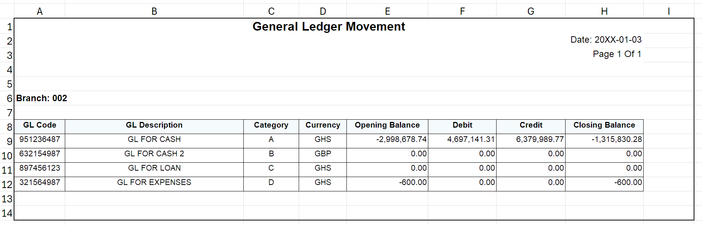
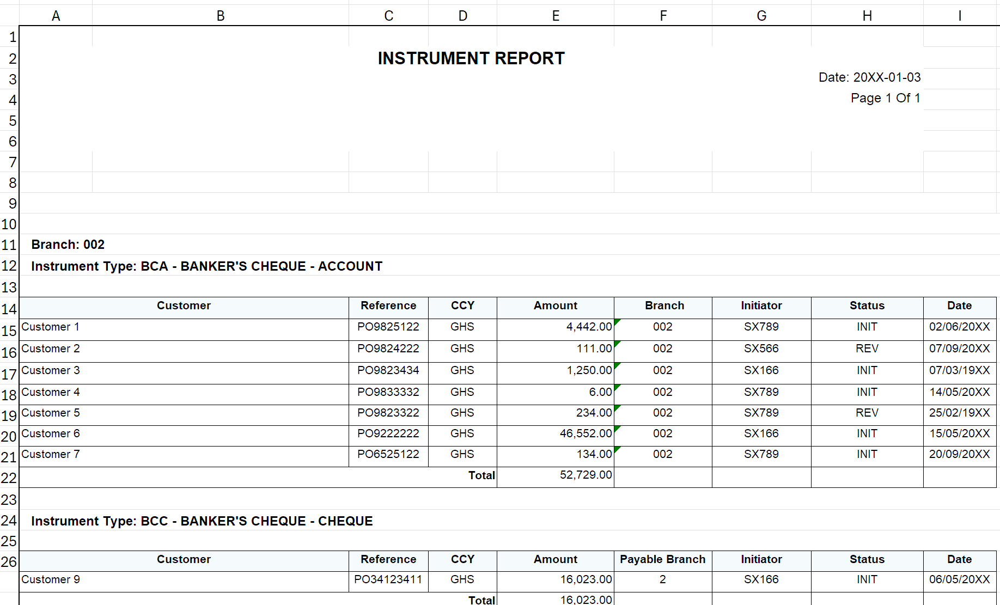
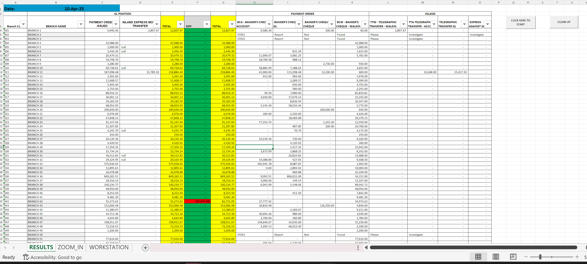
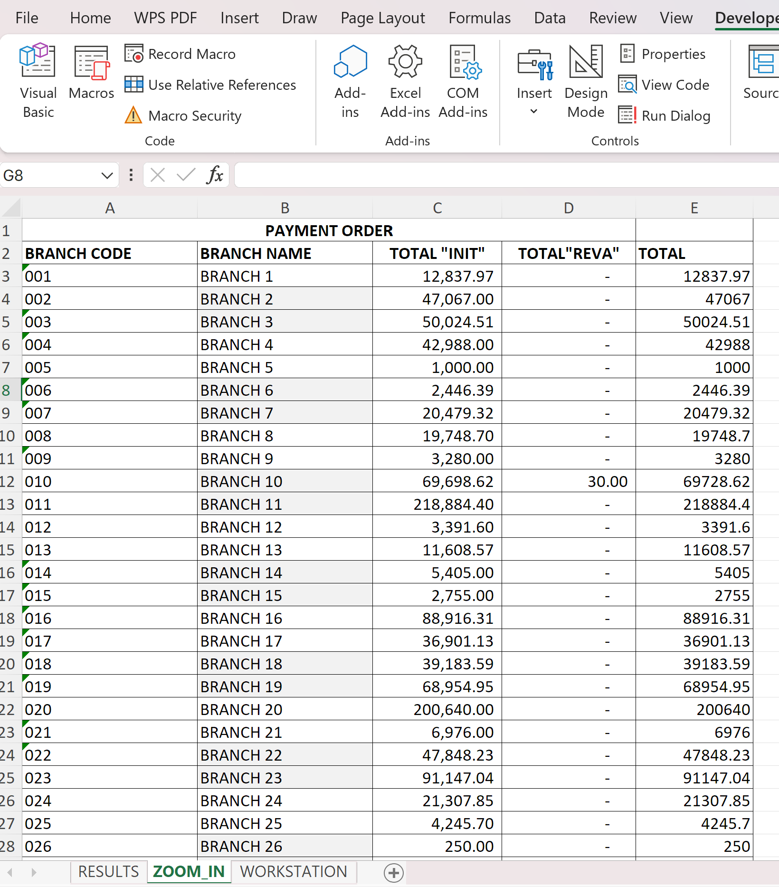

# Payment Order Reconciliation Automation

## 📌 Project Overview

This project automates the reconciliation of payment order transactions across multiple branches using Excel VBA.

The solution was developed to eliminate repetitive manual work and improve the efficiency of daily financial checks.

---

## ⚙️ Problem

* Manual reconciliation took ~6 minutes per branch
* Over 180 branches processed daily
* Highly repetitive and prone to human error

---

## 💡 Solution

I developed a VBA macro that:

* Iterates through branch reports
* Extracts key financial balances
* Compares transaction totals against GL balances
* Flags discrepancies automatically
* Produces a structured summary output

---

## 🔄 Process Breakdown

1. Loop through all branches
2. Open report files dynamically
3. Copy data into a controlled worksheet (workstation)
4. Extract required values using search logic
5. Perform reconciliation checks
6. Output results into summary sheets

---

## 🔍 Reconciliation Logic

A key part of this solution was distinguishing between operational issues and actual discrepancies.

* **Revalidated transactions (REVA):**
  Represent expired payment orders that require reissuance

* If REVA totals match the imbalance → Not a real issue

* If no REVA exists → Requires further investigation

* **Initiated transactions (INIT):**
  Represent active payment orders and provide context but do not directly cause discrepancies

This logic reduces unnecessary investigations and improves efficiency.

---

## 📊 Results / Impact

* Reduced processing time from ~6 minutes per branch to 2–3 minutes total
* Automated reconciliation across 180+ branches
* Improved accuracy and consistency
* Eliminated repetitive manual work

---

## 🛠️ Tools Used

* Excel VBA
* Excel formulas
* Data analysis & reconciliation logic

---

## 📷 Screenshots

### GL Report Preview

### PO Report Preview

### Results Dashboard

### Zoom-In Analysis

---

## ⚠️ Disclaimer

All data, file paths, and identifiers have been modified or anonymised to protect sensitive financial information. The structure and logic remain representative of the original solution.

---

## 🔗 Portfolio Link

(Add your Google Site link here)
